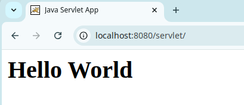

# Шаг 0. Введение

Servlet – в первую очередь это простой Java интерфейс, реализация которого расширяет функциональные возможности сервера - контейнера сервлетов.


Сервлет взаимодействует с клиентами посредством принципа запрос-ответ. Хотя сервлеты могут обслуживать любые запросы, они обычно используются для
расширения веб-серверов. Для таких приложений технология Java Servlet определяет HTTP-специфичные сервлет классы.

# Шаг 1. Создание и конфигурирование проекта

Заходим в нами всеми любимую IDE IntelliJ IDEA и создаем Maven Project. Структура проекта простая и не сложная, один класс и стандартная структура
Maven проекта.


Теперь откройте pom.xml и добавьте туда зависимость, которая позволит нам использовать Servlet-ы.

```xml
<?xml version="1.0" encoding="UTF-8"?>
<project xmlns="http://maven.apache.org/POM/4.0.0"
         xmlns:xsi="http://www.w3.org/2001/XMLSchema-instance"
         xsi:schemaLocation="http://maven.apache.org/POM/4.0.0 http://maven.apache.org/xsd/maven-4.0.0.xsd">
    <modelVersion>4.0.0</modelVersion>

    <groupId>com.example</groupId>
    <artifactId>com.example.servlet</artifactId>
    <version>1.0-SNAPSHOT</version>
    <packaging>war</packaging>

    <dependencies>
        <dependency>
            <groupId>jakarta.servlet</groupId>
            <artifactId>jakarta.servlet-api</artifactId>
            <version>6.0.0</version>
            <scope>provided</scope>
        </dependency>
    </dependencies>

    <build>
        <finalName>servlet</finalName>
    </build>
</project>
```

Обратите внимание, что мы используем Servlet API стандарта Jakarta EE версии 6.0, которая поставляется в составе Tomcat 10.

# Шаг 2. Создание сервлета

Теперь создаем класс `MainServlet.java`, наследуем его от HttpServlet и переопределяем два метода doGet(...) и doPost(...):

```java
package com.example.servlet;

import jakarta.servlet.ServletException;
import jakarta.servlet.http.HttpServlet;
import jakarta.servlet.http.HttpServletRequest;
import jakarta.servlet.http.HttpServletResponse;

import java.io.IOException;

public class MainServlet extends HttpServlet {

    @Override
    protected void doGet(HttpServletRequest req, HttpServletResponse resp)
            throws ServletException, IOException {
        super.doGet(req, resp);
    }

    @Override
    protected void doPost(HttpServletRequest req, HttpServletResponse resp)
            throws ServletException, IOException {
        super.doPost(req, resp);
    }
}
```

### HTTP-методы

Известно, что HTTP-протокол имеет 7 методов передачи данных:

- DELETE
- HEAD
- GET
- OPTIONS
- POST
- PUT
- TRACE

Но только два из них пользуются особой популярностью, а именно GET и POST.

Метод GET вызвать легко, достаточно ввести в браузере ссылку и перейти по ней, а вот POST не так просто выполнить, один из простых способов используя
form тег указать ему action. Но нам все это не потребуется.

Для того чтобы мы могли обрабатывать методы HTTP запроса в нашем сервлете, нужно переопределить соответствующий метод.


Но чаще всего используются методы GET и POST. Именно их мы и разберем на примере.

# Шаг 3. Hello World Servlet

Для того чтобы создать наш первый Hello World нам нужно реализовать метод doGet:

```java

@Override
protected void doGet(HttpServletRequest req, HttpServletResponse resp)
        throws ServletException, IOException {
    PrintWriter out = resp.getWriter();
    out.print("<h1>Hello Servlet</h1>");
}
```

Разберем пример. Как видите метод doGet принимает два параметра:

- `HttpServletRequest req` – это запрос, который пришел к сервлету;
- `HttpServletResponse resp` – это ответ который даст сервлет.

Теперь создаем папку `src/main/webapp/WEB-INF`, а там создаем файл `web.xml` в этом файле мы зарегистрируем наш сервлет и замапим его на URL.

Вот содержимое `web.xml`:

```xml
<?xml version="1.0" encoding="UTF-8"?>
<web-app xmlns:xsi="http://www.w3.org/2001/XMLSchema-instance"
         xmlns="http://java.sun.com/xml/ns/javaee"
         xsi:schemaLocation="http://java.sun.com/xml/ns/javaee http://java.sun.com/xml/ns/javaee/web-app_3_0.xsd"
         version="3.0">

    <servlet>
        <servlet-name>mainServlet</servlet-name>
        <servlet-class>com.example.servlet.MainServlet</servlet-class>
    </servlet>

    <servlet-mapping>
        <servlet-name>mainServlet</servlet-name>
        <url-pattern>/</url-pattern>
    </servlet-mapping>
</web-app>
```

Мы описали два тега `servlet` и `servlet-mapping` и которые и заставят наш сервлет показаться в браузере по URL – `/`

В **строке 8** мы указываем имя сервлета (оно может быть любое) это имя является идентификатором, и должно быть уникальным.

В **строке 9** мы указываем полный пакетный путь к севрлету. После чего мы можем к нему обращаться по его name (идентификатору).

В **строке 13** мы указываем имя сервлета (идентификатор) который хотим замапить на определенный URL.

**Строка 14** говорит на какой URL мапить сервлет. Так как у нас стоит `/` – это значит что зайдя в корень проекта http://localhost:8080/servlet/ мы
получим сервлет, а именно то что в методе doGet.

Теперь собираем проект командой `mvn package`:


Запускаем, как это сделать рассказано тут - [Деплой на Tomcat](INSTALL.MD).

После запуска перейдите по ссылке http://localhost:8080/servlet/. Вы увидите следующее:


Дальше мы рассмотрим более правильный способ использования Servlets в веб-проектах.

# Шаг 4. Используем JSP

Не совсем красиво выводить все HTML теги посредством response. Поэтому давайте прикрутим к сервлету jsp страничку.

Для этого создаем `mypage.jsp` в `webapp`:


И содержимое этого файла:

```html
<%@ page contentType="text/html;charset=UTF-8" language="java" %>
<html>
<head>
    <title>Java Servlet App</title>
</head>
<body>
<h1>Hello JSP</h1>
</body>
</html>
```

Обратите внимание на первую строку, где мы указываем кодировку страницы, если этого не сделать то символы, в том числе и русские, будут отображаться
не корректно.

Дальше редактируем метод `doGet` в нашем `MainServlet`:

```java

@Override
protected void doGet(HttpServletRequest req, HttpServletResponse resp)
        throws ServletException, IOException {
    req.getRequestDispatcher("mypage.jsp").forward(req, resp);
}
```

В 15-й строке мы с запроса получаем Request Dispatcher (Диспетчер Запросов) и указываем ему jsp страницу, которая будет отображаться при обращении к
данному методу GET. Метод forward(req, resp) перенаправляет наш запрос на jsp страницу.

Теперь если пересобрать приложение Maven-ом и запустить, то получим уже вывод на страницу в браузере содержимого mypage.jsp:


# Шаг 5. Передаем данные с Servlet на JSP

Для того чтобы передать какие-либо дынные на JSP, нам нужно в сервлете в request добавить атрибут.

Чтобы добавить атрибут в request нужно вызвать метод `setAttribute(String key, Object value)`, где

- **key** – это ключ по которому вы получите доступ к данным на JSP;
- **value** – данные которые мы передаем.

```java

@Override
protected void doGet(HttpServletRequest req, HttpServletResponse resp)
        throws ServletException, IOException {
    req.setAttribute("name", "World");
    req.getRequestDispatcher("mypage.jsp").forward(req, resp);
}
```

Как видите в строке 15 я передаю имя с ключом (name) и значением (World).

Теперь, чтобы принять эти данные на JSP, нужно обратится к ключу по определенной конструкции `${key}`

Давайте на нашей `mypage.jsp` примем данные с сервлета:

```html
<%@ page contentType="text/html;charset=UTF-8" language="java" %>
<html>
<head>
    <title>Java Servlet App</title>
</head>
<body>
<h1>Hello ${name}</h1>
</body>
</html>
```

Теперь пересобираем проект с помощью Maven и запускаем. Мы увидим следующий результат:



# Шаг 6. Улучшаем сервлет и удаляем web.xml

Согласитесь не совсем удобно регистрировать наш сервлет в web.xml, особенно если у нас будет не один-два сервлета, а 100+, тогда это будет неудобно :)
Но в этом есть и плюс, когда все сервлеты зарегистрированы в одном месте, а именно web.xml мы можем удобно их перемапить на другой URL.

Для начало проаннотируем сервлет аннотацией @WebServlet:

```java

@WebServlet("/")
public class MainServlet extends HttpServlet {

    @Override
    protected void doGet(HttpServletRequest req, HttpServletResponse resp)
            throws ServletException, IOException {
        req.setAttribute("name", "World");
        req.getRequestDispatcher("mypage.jsp").forward(req, resp);
    }
}
```

Данная аннотация регистрирует сервлет в контексте приложения, это то же самое, что мы делали в web.xml.

Аннотация принимает как параметр строку, именно эта строка соответствует тегу url-pattern, то есть это URL по которому будет доступен сервлет.

Вы возможно зададите вопрос, – Зачем тогда этот web.xml? В нашем случае он уже не нужен, поэтому смело его удаляем вместе с папкой WEB-INF.

Конечная структура проекта выглядит так:


Теперь пересобираем проект вызвав в Maven фазу Install и деплоим на сервер приложений. И мы получим тот же результат, но без лишних файлов и с
аннотацией.